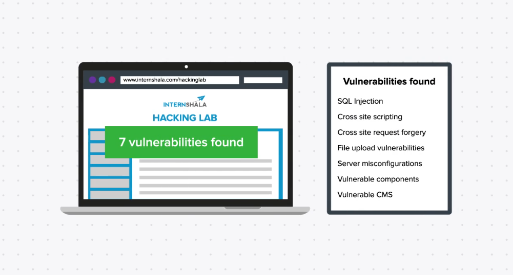
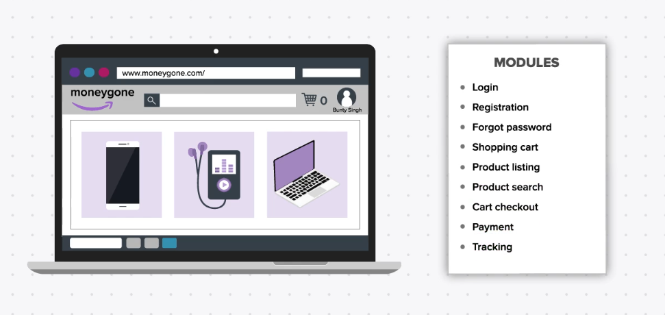
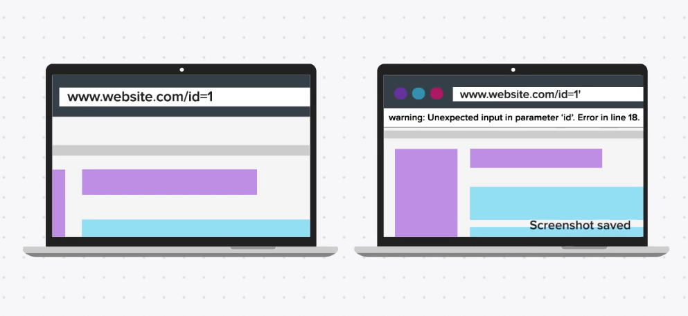
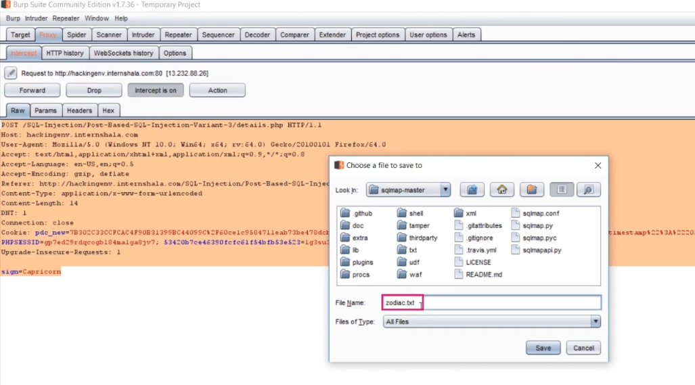
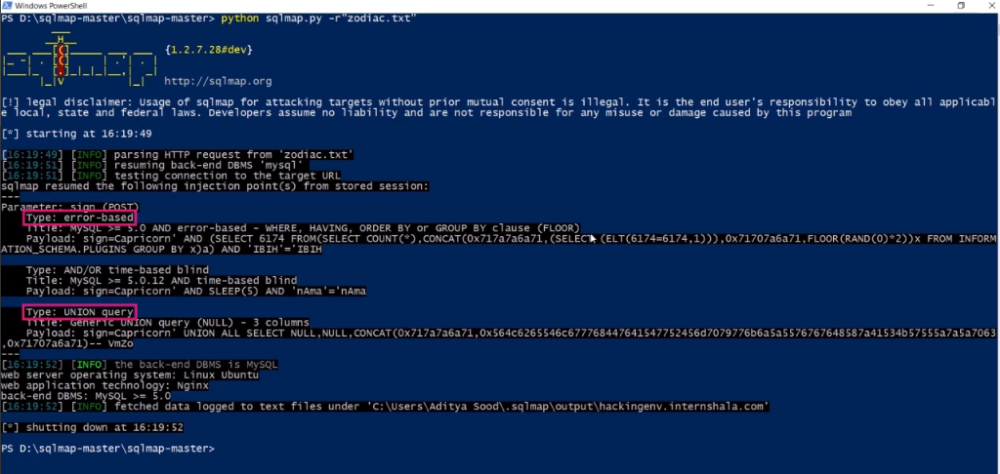
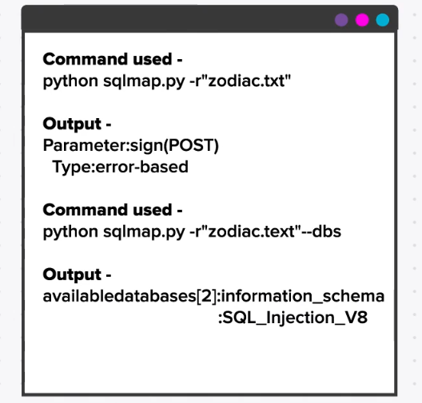

## Documenting Stages of Vulnerabilities using Tools
After finding all the vulnerability how to report them to the organization let see.

One way is to write everything in the mail but don't you think it will become too lengthy, Developer who is going to patch it might not understand you writing since he is not a security expert.
If he doesn't understand than your effort is no use for the organization.

So, the best way is to `Generate Report` the 8th steps of white hack methodology.
This Document contains `screenshot`, `proper notes`, `command` and `video`. It should also show how much impact these vulnerabilities may cause to the organization.
It is also called as `POC` Proof of Concept.

>Now, let’s say we were to create a PoC for the hacking lab.  
And let’s say it took you 7 days to completely test the entire hacking lab.  
Now, will it be right if you go again through the entire lab and find the vulnerabilities again so that you can take relevant screenshots and record videos?  
No, It would be such a waste of time, right?  
Also, remember, when you take up such projects, you will get paid for all the tasks you do, and the time you spend in conducting the VAPT. And sometimes, you may not find the same vulnerability again as the developer may see what you are testing and patch some minor vulnerability even before you report it. So, if you were to take screenshots at a later time, you may lose out on this vulnerability that you had found.  
Also, sometimes there could be a power cut, or system shut down while you are testing the application and you may lose important data. This means that you will have to find the vulnerability all over again, and sometimes when the tests are complicated, it is not easy to do so.  
    So, it is strongly recommended that you take screenshots and videos while you are testing the application.

**`Note`**: Report which is organized and well structured is only made by the best of the experts.

`First Steps` in Documenting note down all key modules.

**Reporting SQL Injection**
	Take a screenshot of the URL, next take a screenshot of the URL and the error visible in it.
	

**Post Based Request**
If it is a `POST` based request then we need to copy the entire Http request from `burp-suite` and save it in a file with the correct name, then proceed with the testing.

When you pass this request to SQL-map, it shows some SQL vulnerability.
For the note, you write down the command used in SQL-map and for the proof take the screenshot of the command used and output of the command.

The next steps are to exploit the SQL vulnerability, so you used SQL-map switches to get database name, For the POC we need to write these command and along with the output you got.

If the attack is complicated you can make a video of the entire attack, and make sure your video is in mute.

**`Note:`** These steps can be used in any attack.

### POC Content
`scenario` let's say you run **Nikto** on a website and you find an old version of WordPress installed on it. Also, you run **wp-scan** on it and you found vulnerable theme installed on it. And you can also able to upload the **shell script** file.
So what content should be on the `POC`.

**Steps for POC**
- Nikto's command and output
- Screenshot's of where Nikto tells about an old version of WordPress
- Wp-scan command and its output
- Screenshot of wp-scan windows showing the vulnerability of the theme.
- CVE ID and Reference links of vulnerability
- Link to the exploit used to attack the vulnerability.
- Screenshot of running the exploits.
- Screenshot of successful shell upload
- Path of the uploaded shell
- Some samples of what can be done once the shells are uploaded.

### Tools used for Preparing Reports
 1. Capture Screenshoot
	 - Windows User : `Snipping Tools`
	 -  Mac User : `Shift + Command + 4`
	 - Linux User : `Shift + PrintScr`
2. Record Video 
	- CamStudio
	- HyperCam
3. Taking Notes
	- Sublime Text
	- Notepad ++

### Common Tips for POC
**Some common tips for taking a PoC:**

-   Take a screenshot of everything. You might not need it but it’s better than to regret later.
-   Take relevant screenshots with only the required region. The developer doesn’t need to see your entire desktop and taskbar while you are trying to show him an XSS popup.
-   Make mute videos and use text editors to type instructions. It is much more convenient.
-   Write down every step of your process in your text editor, be it information gathering and the information you found, vulnerabilities found, interesting blogs/links that you read to find, test and exploit vulnerabilities, links to automate scripts/exploits you found online, data you found after exploitation, everything!
-   Use the proper folder and file structure.
-   Make sure that this data is backed up and secure. Use Google Drive, Dropbox, Onedrive, etc. to constantly backup the screenshot folders and VAPT project folders to the cloud.
-   Also, make sure these are safe and secure since if someone gets hold of this, he/she will be able to cause critical damage to the organization and you will get into trouble.

***MCQ***

1. What does proof of concept mean?
	- [ ] A presentation describing the tools that are used to exploit the vulnerability.
	- [ ] A video showing how the attacker can exploit a vulnerability in a website.
	- [ ] A text file showing the steps that are used to find the vulnerability.
	- [x] All of the above
	> **Explanation:**
	> A PoC in ethical hacking is a collection of evidence like screenshots, videos and HTTP requests along with a sequence of steps that were used to test and exploit a loophole. These steps must be explained in such a way that a technical person like a developer should be able to follow the steps and replicate the same vulnerability at his end. A POC can be in any format like ppt, text file or video.

2. Prithvi found an SQL injection vulnerability in a bug bounty program and forgot to take the screenshots of the vulnerability. He thought of reporting it the next day and went to bed. Now once he woke up and tried to exploit again he found that the vulnerability had been patched. So he decided to report to the company saying that he found an SQL injection on the website but he forgot to take the screenshot. Will the company reward him the bounty since the vulnerability existed before?
	- [ ] Yes
	- [x] No
	> **Explanation:**
	The first step when you find a vulnerability in a website is to take a screenshot or a video describing the vulnerability and report it asap. Companies patch the flaws immediately when they notice a flaw in their website. Even if the flaw existed on their website before, but if it has been patched, the company will not consider the flaw. So to consider the bug as a valid or to get the bounty in a bounty program the researcher should submit the bug with valid proof of concept and be the first one to do so.

3. If you find an SQL injection vulnerability, which of the following parts should you provide as a proof of concept in your report to the developers?
	- [ ] The URL and parameter you found the SQL injection in
	- [ ] Databases, table names and data you were able to extract
	- [ ] Screenshot of the vulnerability with the step by step guide on how to replicate it
	- [x] All of the above
	>**Explanation:**
	>You need to provide complete information in your proof of concept like including what you found, where you found it, how you exploited it with steps and guide, how to fix it and some references so that the developer can read more about it.

4. Which of the following is an important note that you need to keep in mind while taking a PoC?
	- [ ] Use proper folder and file structure
	- [ ] Write down every step of your process in your text editor
	- [ ] Take relevant screenshots with only the required region.
	- [ ] Make mute videos and use text editors to type the instructions
	- [x] All of the above
	> **Explanation:**
	> When generating a PoC there are many important things to consider, like taking relevant screenshots with only the required region, making mute videos and using text editors to type instructions and writing down every step of your process in your text editor- be it information gathering and information you found, vulnerabilities, interesting blogs/links that you read to find, test and exploit vulnerabilities, links to automated scripts/exploits you find online, data you find after exploitation, everything!