# Parts of VAPT Report
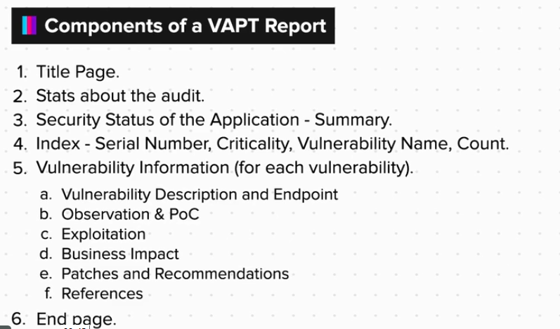

### Title Page

**`Color Coding Used`**
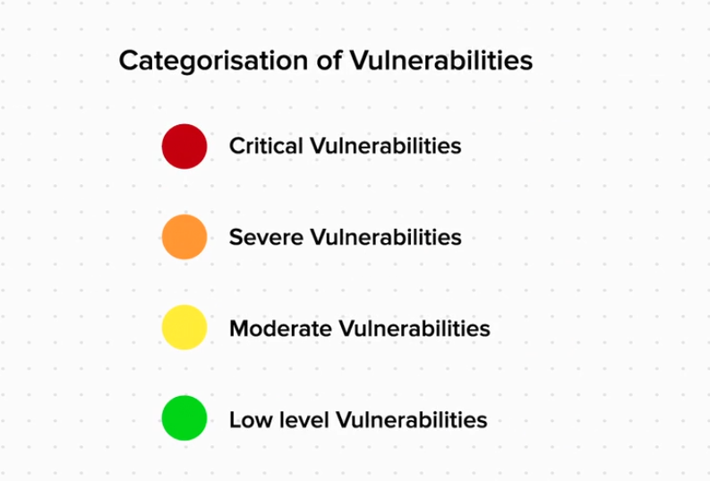

### Stats about the audit
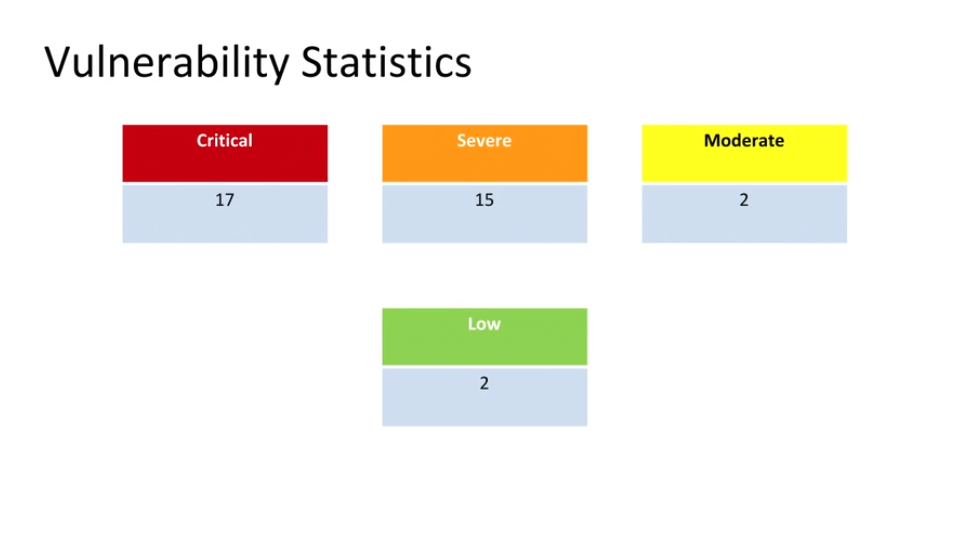

### Security Status of the Application - Summary
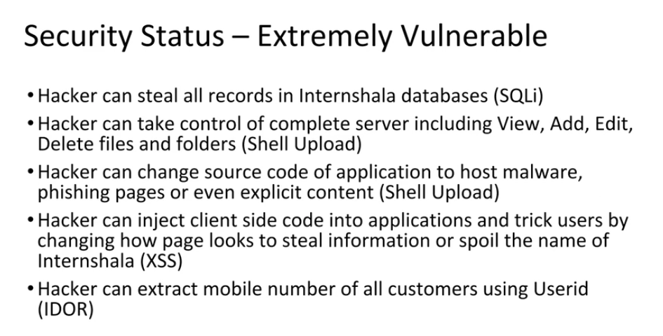

### Index - Serial Number, Criticality, Vulnerability Name, Count
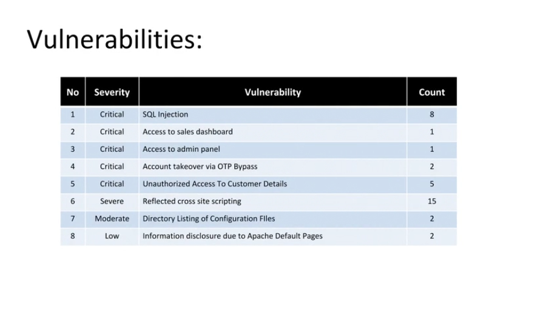

### Vulnerability Information (for each Vulnerability)
1. **Vulnerability Description and Endpoint**

    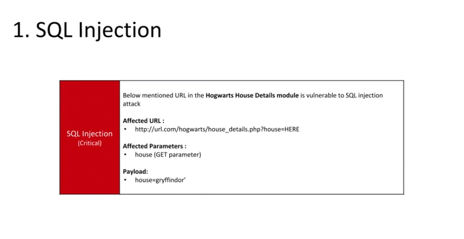

2. **Observation & POC**
    
    Observation
    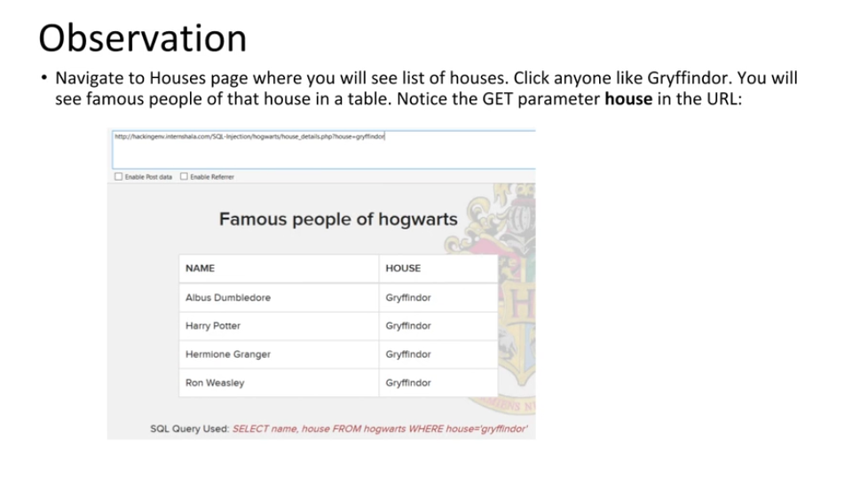

    POC
    

3. **Exploitation**

    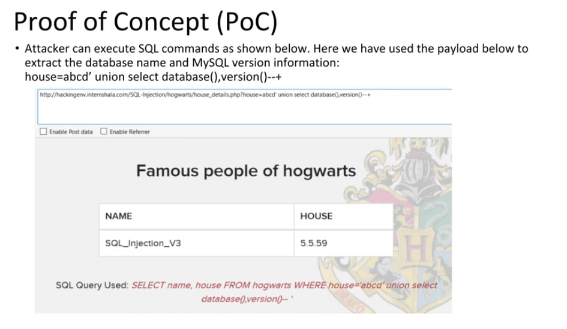

4. **Business Impact**

    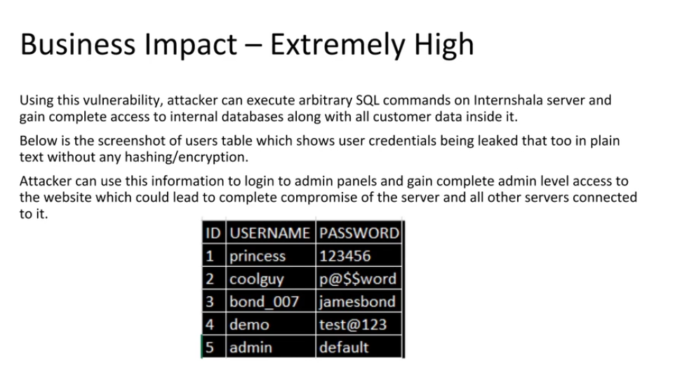

5. **Patches and Recommendation**

    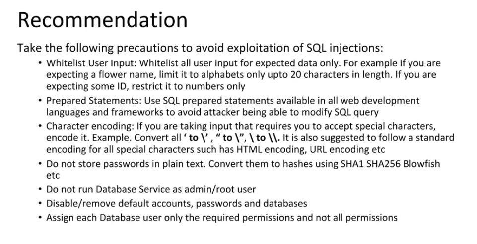

6. **References**

    

### END
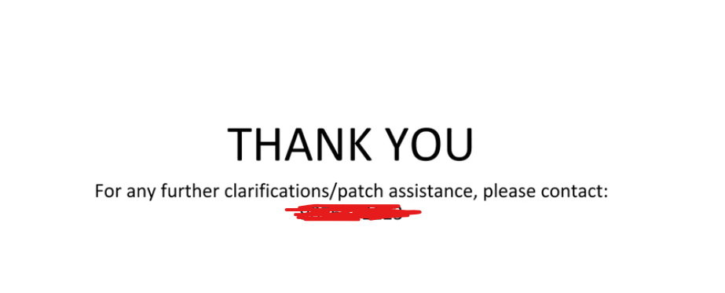