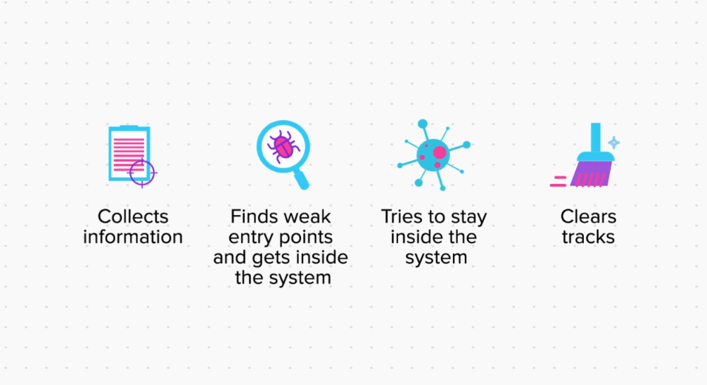
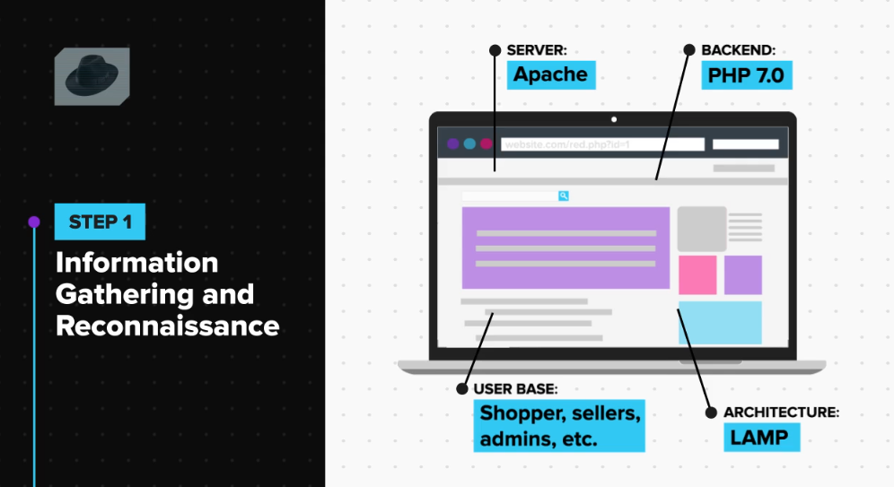
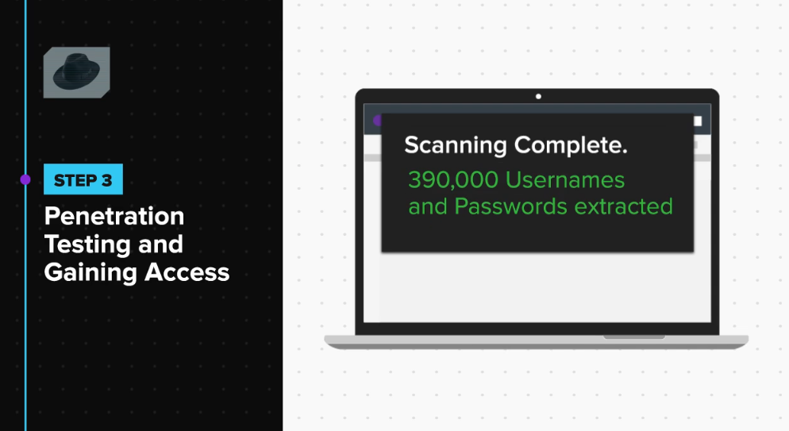
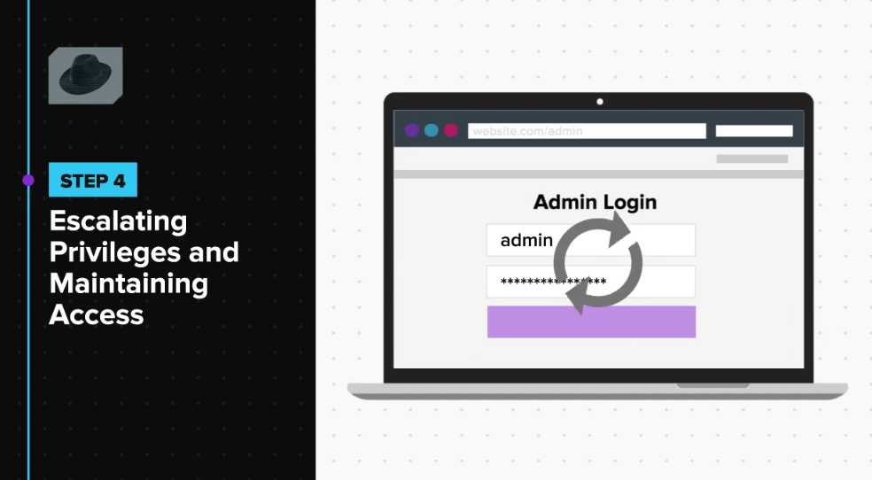

## Hacking Methodologies and Security Auditing
### Steps followed by hacker
**General Steps**

#### Black Hat Hacker

`Note`: A backdoor is a program which let hacker access the system anytime, as long as the backdoor is installed in the system.
Suppose you get access to a system, a few days later system owner changes the credential then you will not be able to access that system, you need to find another way to get into it, to avoid the extra hassle expert install a backdoor. 
This way no matter how tight the security gets as long as the backdoor is installed on the system, the hacker will have access to the system.

`Note`:  
 1. He deletes all server log file
 2. Remove any additionally installed software
 3. Delete all extra user that was created
 4. Delete all backdoors
 5. Revert the server how it was before the hack

#### White Hack Hacker (Security Expert or Security Auditor)
 
Steps 1: Legal Documentation

 - `Memorandum of Understanding` - Which describes the testing activity and steps that will be taken on a legal paper.
 - `Non-Disclosure Agreement` - Where both the party agrees that they will not disclose any activity of the exercise such as cost involves, the vulnerability found, detail of the researcher, etc.
 - `Financial Agreement`- Which describes the cost on a legal paper.
 
Steps 2: Scope Assessment

> Here we decide What needs to be tested? And how much time it will take.

Steps 3: Information Assessment
> Here the client provides some information about the system to the security expert and the expert analyzes it.
 Like:- `Test Account`, `Server Details`, `Backend Languages`, `Architecture of the Website`, etc.
 Security Expert Analyses this information and check what information can be used for the upcoming phases.

Steps 4: Vulnerability Assessment

> Here Security Experts find all the vulnerability and verify it and documents them.

Steps 5: Penetration Testing
> In these steps the security expert exploits all the vulnerability and documents the result.
> The security experts try to attack the system just like Black Hat Hacker. But Unlike the Black Hat Hacker the motive of the security experts is not to harm the organization, but to find the maximum damage The Black Hat Hacker can cause if he tries to cause the system.
> The Security Experts than document the exploitability of all the vulnerability and makes a `Proof of Concepts` (POC) of all vulnerabilities.

Steps 6: Gaining Access
> After finding the exploits the security experts than try to gain access to the internal system like `servers`, `data`, etc.

Steps 7: Privilege Escalation
> In these steps he tries to escalate the access from a normal user to admin.

Steps 8: Report Generation
> The security experts compile a descriptive and well-formulated report of the entire exercise.
> This contains an explanation of the impact of various vulnerabilities found.

Steps 9: Patch Assistance
> Once the vulnerability and impact have been communicated with the organization. The organization than decide which one they need to fix and patch it depends on the risk involves also the cost and efforts involves in patching them.
> Now the Developer patches the vulnerability and the security expert assist him in doing so.

Steps 10: Revalidation
> Now that the developer has patched the vulnerability the security experts need to recheck if they have properly patch. If not he must assist the developer to patch them.

***MCQ***

 1. You carry out a security auditing exercise for an organization after signing all the required documents (MoU, NDA, PO, Financial Agreement, etc) and find a critical flaw in their website which discloses Aadhaar card numbers of all its customers. You go home and excitedly tell that to your elder brother and you both laugh about the silly mistakes they did. The next day, your brother posts on social media regarding the poor security of the organization you tested and tells everyone about the aadhar card details being leaked on their website. What can be the implications of this act?
	 - [ ] The company can terminate your contract and hold your payment

	- [ ] The company can file a case against you for defacement of their identity

	- [ ] The company can file a case against you for breaking the agreements that you signed

	- [x] All of the above
	

	> **Explanation:**
	> Since you have signed the legal documents to keep the agreement and its outcomes a secret, if you fail to do so, it is you who will be held against the laws. Sharing the details of a pentesting exercise with even your closest ones is not considered a good practice.

2. Which of these document/s prevent you from sharing information about the client and the outcomes of the exercise?
	- [x] NDA
	> **Explanation:**
	The NDA - Non-Disclosure Agreement simply states that you cannot share the details of the arrangement between you and the company, including but not limited to the fact that the organization is your client, the flaws you found, any internal information that was given to you about their infrastructure and even the financials you agreed upon. Although these might change as per the requirements of both the parties.
	- [ ] Financial Agreement
	- [ ] MoU
	- [ ] All of the above
	- [ ] Option 1 and 3

3. Once a black hat hacker clears all tracks, he cannot be caught.
	- [ ] True
	- [x] False
	> **Explanation:**
	No matter how well a black hat hacker clears his tracks if the crime is capital enough, the authorities will put all efforts to trace him, like using data forensics, hiring white hat hackers and even using statewide surveillance. In simple words, it depends on what the hacker has done, and who is after him.

### Types of Security Testing
Security Testing is performed by a white hat hacker also called penetration testing.
When an organization hires a security expert they can ask him to do the testing on his own without any help or they can help him with testing.
#### Based on the level of assistance provided by the organization to do security testing conduct by a security expert. They can be divided into three types:-

 1. White-Box testing
 2.  Black-Box testing
 3. Grey-Box testing

`White-Box` testing here the security experts get complete assistance from the organization. Like Architecture, Demo Accounts, Source Code, Server Details.
>   The goal of this exercise is to make sure that not even a slightest loophole is left unprotected no matter how hard a malicious hacker tries to exploit it.

`Black-Box` testing here the security experts get no assistance from the organization.
>   The goal of this exercise is to understand how a malicious hacker can harm an organization without any assistance from the organization.

`Grey-Box` testing it is a mixer of white-box and black-box testing, here the security experts get partial assistance from the organization.
>  The goal of this exercise is to see how a hacker who has some basic knowledge about the organization can harm the organization.

#### Based on the location of testing, It can be divided into two types:-
1. Internal Testing
2. External Testing

`Internal` Testing, When the security experts test the application from the premises of the organization, it is called internal testing.
Here the server, application, and assets of the organization are connected to the internal network or private network so the security expert can connect to that network and perform the security testing.

`External` Testing, when the security experts test the application from outside the premises of the organization, it is called as external testing
Here the server, application, and assets of the organization are connected to the internet so the security experts can simply connect to the internet and perform the testing from where ever he wants.

***MCQ***

 1.  The source code is provided in black-box testing to ensure that all vulnerabilities are reported.
	 - [ ] True
	 - [x] False
	 > **Explanation:**
	 Black box testing is done from the perspective of a black hat hacker and so no source code is provided. This is done to see what a tester can do without any internal knowledge of the infrastructure.

2. White box testing reveals more bugs than black-box testing.
	- [x] True
	> **Explanation:**
	During a white box test, the complete architecture of an application is made transparent to the hacker, and so he is able to look at even the smallest configurations and user roles and find flaws in them; whereas in a black-box test, a lot of time is spent in proper information gathering since not much is known about the target and hence lesser possibilities of finding a lot of bugs.
	- [ ] False

3. A company wants to have its office computers scanned for vulnerabilities to make sure they aren't leaking any data. What kind of testing will be required for this purpose?
	- [x] Internal Testing
	> **Explanation:**
	Since the computers are connected to the office network, to test them, the hacker will also need to be at the office premises. That’s why internal testing will be required to directly test the devices.
	- [ ] External Testing